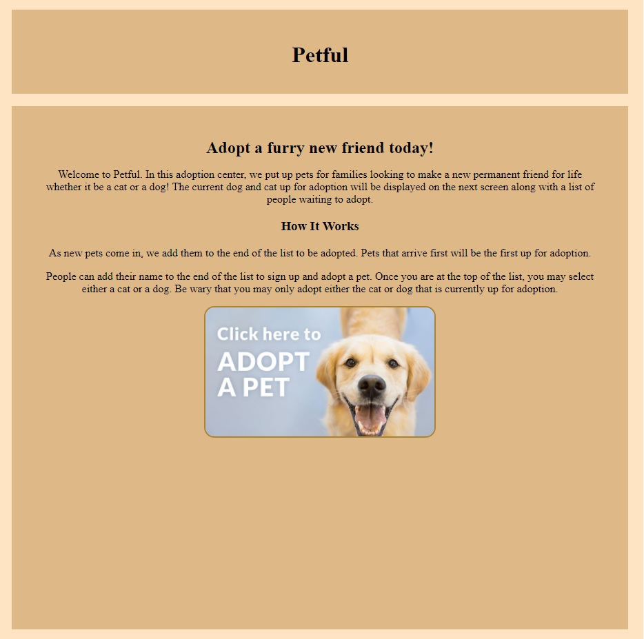
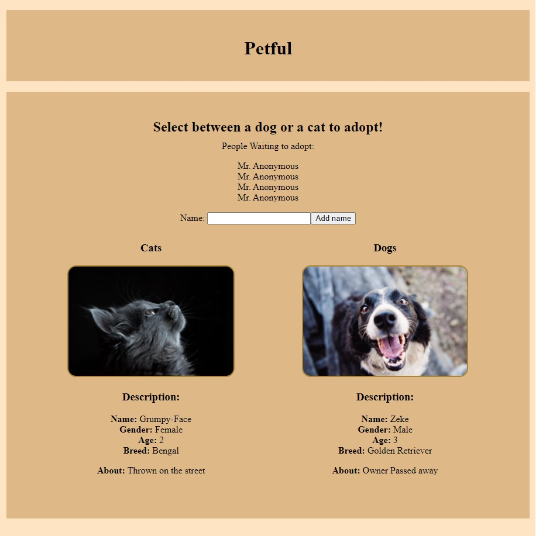
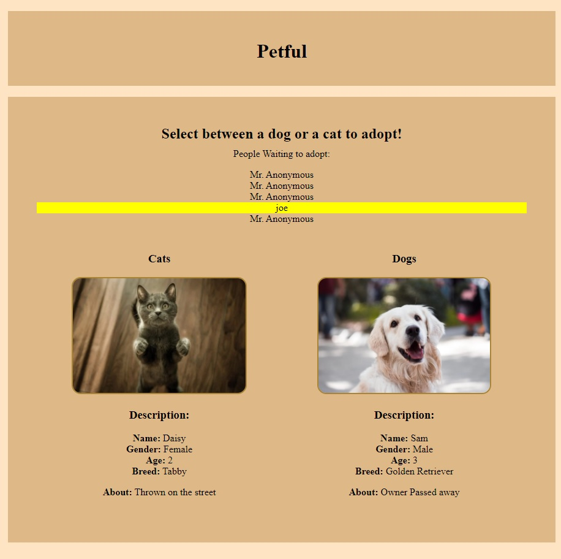
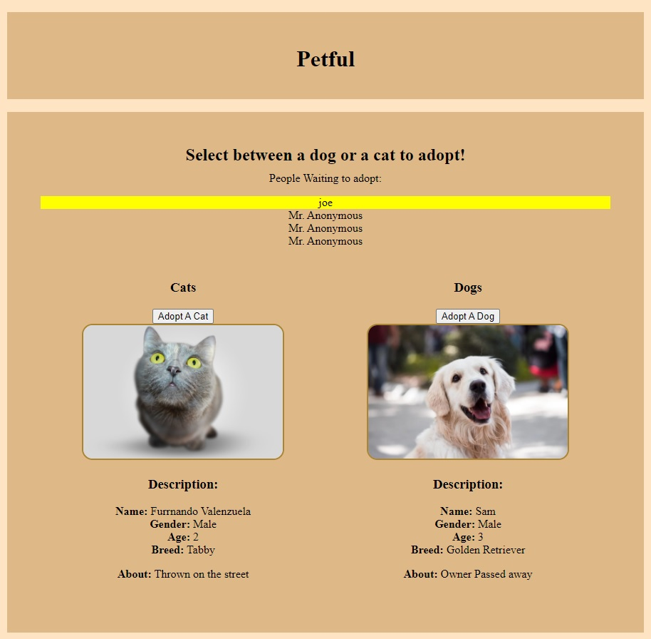
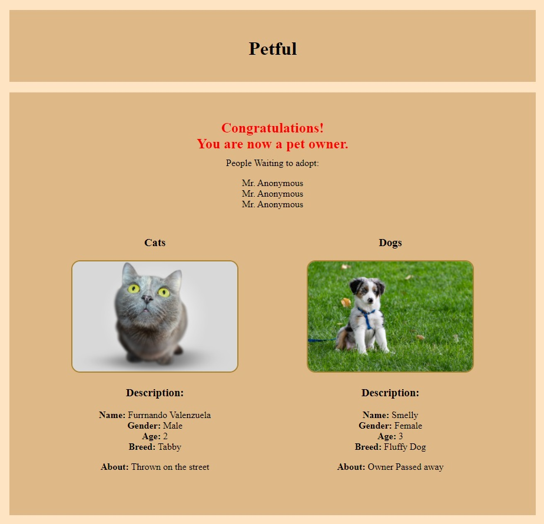

# Petful Client

[Live App](https://rb-petful.vercel.app/)

[Client Repo](https://github.com/BarreraR/Petful-Client)

[Server Repo](https://github.com/BarreraR/Petful-Server)

## Stack Used

ReactJS, CSS, HTML

## Summary

Connects to an API to get pets up for adoption in a FIFO structure. 

## Screenshots

Home page displays description of adoption process.

---

Enter your name to be added to list of people waiting to adopt.

---

Once your name is added, it will be highlighted in yellow.

---

When you are at the top of the list, you will be able to select from adopting a cat or a dog.

---

Confirmation message lets you know that a pet was adopted.
